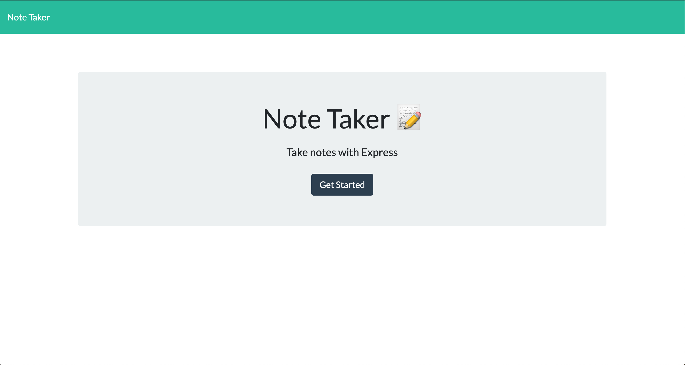
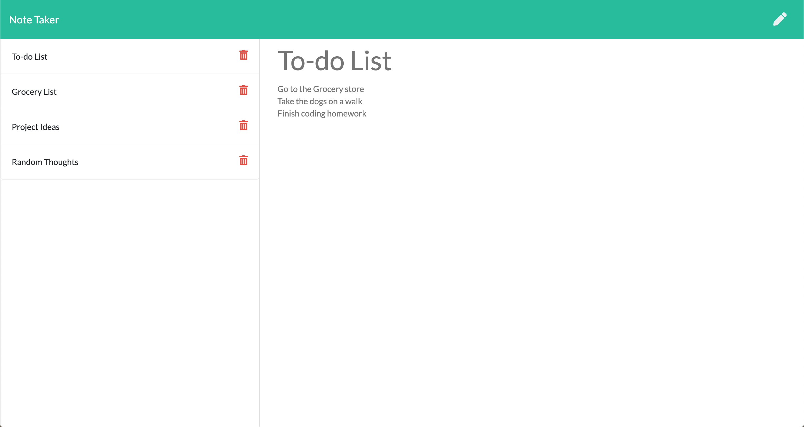
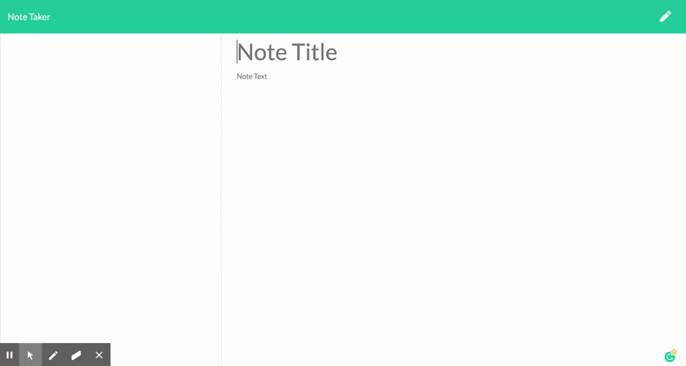

# Scratchpad

Have you ever walked through a door frame and forgot what you walked in the room to get? Nowadays, our brains are non stop, always looking ahead to the next thing on our list of to-do's so much so that we often forget about smaller ideas that pop into our heads. Thats where Scratchpad comes into play, this simple express application allows the user to save, view, and delete notes on the go! 

Building this application thought me how to build and integrate a back-end server using express. I learned about connecting the front-end and the backend through ajax calls paired with proper backend api routes. I learned how to properly work with promises and asynchronous calls. Lastly, it also taught me the importance of project organization and prework. Having everything laid out before I started building routes allowed me to keep my work flow clear and concise. 

Some of the problems that I encountered and overcame while building this application involved implementing the full C.R.U.D circle for a static JSON db. Initially, I was able to get the proper data/actions that I wanted from the front end, but struggled to read and write to the static JSON file. 

## Table of Contents
* [Technologies](#technologies)
* [Usage](#usage)
* [Finished Product](#finished-product)
* [Questions](#questions)

## Technologies
* JavaScript
* Node.js
* Express.js
* Heroku
* HTML
* CSS
* Bootstrap

## Usage
* Navigate to the [deployed Heroku App](https://blooming-plains-50857.herokuapp.com/).
* Click the get started button.
* Add a note title and body in the provided text box.
* Save your note by clicking the save icon.
* View a list of your saved notes on the left hand side.
* Click on any note in the list to view your full note.
* Create a new note at any time by clicking the pencil button.
* Delete any note by pressing it's "trashcan" icon.

## Finished Product
View deployed Heroku app [here](https://blooming-plains-50857.herokuapp.com/).

## Questions
​
If you have any questions about the repo, please contact me:

On GitHub: [ngoudeau2012](https://github.com/ngoudeau2012) | Via Email: ngoudeau2012@gmail.com